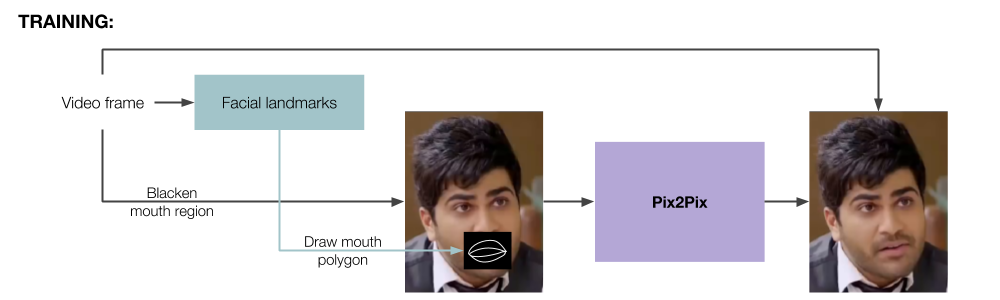

# movie-translation-experiments

My experiments with translation of lip movement in movies from one dialogue to another, possibly across languages.

Tentative pipeline:




# dataset_creation, exchange_dialogues

Stuff related specifically to the MOVIE_TRANSLATION database. See README inside these directories for more info.

# INSTALLATION

The requirements have been listed in requirements.txt file.

Apart from them, to get 3D landmarks, the following repository is required: [face_alignment](https://github.com/1adrianb/face-alignment) - 2D and 3D Face alignment library build using pytorch.

The installation instructions for this for Ubuntu are (according to the [face_alignment](https://github.com/1adrianb/face-alignment) page):

- `pip3 install numpy pyyaml mkl setuptools cmake gcc cffi`
    - I had problems installing gcc, but I skipped it because it was already installed (and might not be possible via pip)

(In case conda is not installed: [miniconda3](https://conda.io/miniconda.html))

- `conda install -c soumith magma-cuda80` (Depending on CUDA version: can be checked via ```nvcc -V```; I installed ```conda install -c soumith magma-cuda91``` for CUDA 9.1)

- Install Pytorch
    - `git clone --recursive https://github.com/pytorch/pytorch`
    - `python3 setup.py install`

- Install face_alignment
    - `git clone https://github.com/1adrianb/face-alignment`
    - `sudo pip3 install -r requirements.txt`

    At this point, I got the error `"-- Could NOT find Boost"`, and instructions to install Boost (following).

    While installing boost, encountered error `'fatal error: pyconfig.h: No such file or directory'`. Solved using `export CPLUS_INCLUDE_PATH=/home/voletiv/miniconda3/include/python3.6m/` (https://github.com/BVLC/caffe/issues/410)

    - Install Boost

```
  --  *****************************************************************************************************
  --  To compile Boost.Python yourself download boost from boost.org and then go into the boost root folder
  --  and run these commands:
  --     ./bootstrap.sh --with-libraries=python
  --     ./b2
  --     sudo ./b2 install
  --  *****************************************************************************************************
```
    - `python3 setup.py install`

# face_recognition

Experiments with face recogntion - use dlib's face recognition model to make face embedding and compare distances for different faces.

# dynamic_programming

Given a source_video and a target_audio, make a new video with its audio as target_audio, and the frames warped from source_video such that they match target_audio's timing. The mapping of audio and frames is done via dynamic programming.

- Extract part of Andrew Ng's tutorial video using ffmpeg, and save in appropriate file

```ffmpeg -ss 00:09:22 -i ../CV/04.C4W1L04\ Padding.mp4 -t 00:00:27 -vcodec libx264 -preset ultrafast -profile:v main -acodec aac -strict -2 CV_04_C4W1L04_000922_to_000949.mp4```

- Record the same dialogues by someone else - CV_04_C4W1L04_000922_to_000949_ma.mp3

- Use dynamic programming to change video timing to match audio

```python movie-translation-experiments/dynamic_programming/align_new_audio_to_video.py CV_04_C4W1L04_000922_to_000949.mp4 CV_04_C4W1L04_000922_to_000949_ma.mp3 CV_04_C4W1L04_000922_to_000949_ma.mp4```

_Dynamic programming reference_ - "A Maximum Likelihood Stereo Algorithm" - Ingemar J. Cox, Sunita L. Hingorani, Satish B. Rao [pdf](https://pdfs.semanticscholar.org/b232/e3426e0014389ea05132ea8d08789dcc0566.pdf)

# andrew_ng

Experiments with Andrew Ng videos - making dataset by checking his face every 10th frame, extracting landmarks, etc.

