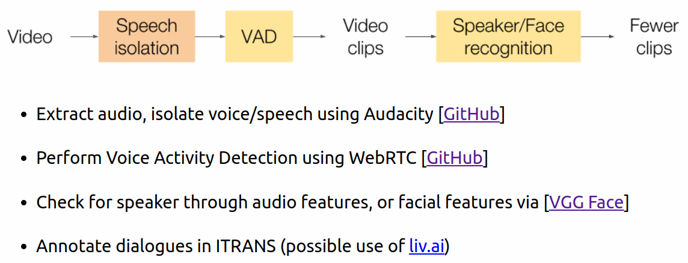

# Automated pipeline of Movie Translation data creation

Example run of `extract_video_clips_via_VAD.py`:

`python3 extract_video_clips_via_VAD.py /path/to/video_file.mp4 [-o /path/to/video/clips/output/] [-a /path/to/the/extracted/audio/of/video/hopefully/after/speech/isolation.wav] [--aggressiveness 2] [--verbose 1]`

or:

`python3 extract_video_clips_via_VAD.py /path/to/video_file.mp4 [-o /path/to/video/clips/output/] [-a /dir/to/save/audio/extracted/from/video/] [--aggressiveness 2] [--verbose 1]`

Right now, `extract_video_clips_via_VAD.py` conducts the following steps:

- Extract audio from video*
    - If `-a` or `--audio-file-path` is not mentioned, extract audio from video using ffmpeg and save in `/tmp/my_audio.wav`
    - If `-a` or `--audio-file-path` is followed by a .wav file name, that audio file is read as the (hopefully speech-isolated) audio of the video to be clipped

- Extract speech segments from audio
    - Use [webRTC](https://github.com/wiseman/py-webrtcvad) to extract speech segments from the audio extracted in the previous step
    - This takes the aggressiveness of filtering as an optional argument, given from the command line as `-agg` or `--aggressiveness`

- Write video segments
    - Use ffmpeg to clip the input video into segments based on the speech segments extracted in the previous step
    - Save the segments in the directory mentioned after `-o` or `--output-dir` in the command line, or the same folder as the input video if `-o` or `--output-dir` is not mentioned

- Write the details of speech segments extraction into a .txt file
    - Write `video_file_output_path speech_start_time speech_duration` information, i.e. the name of the clipped video, its starting time in the original video, and its duration, in a .txt file in the output directory (as described in the previous point)

